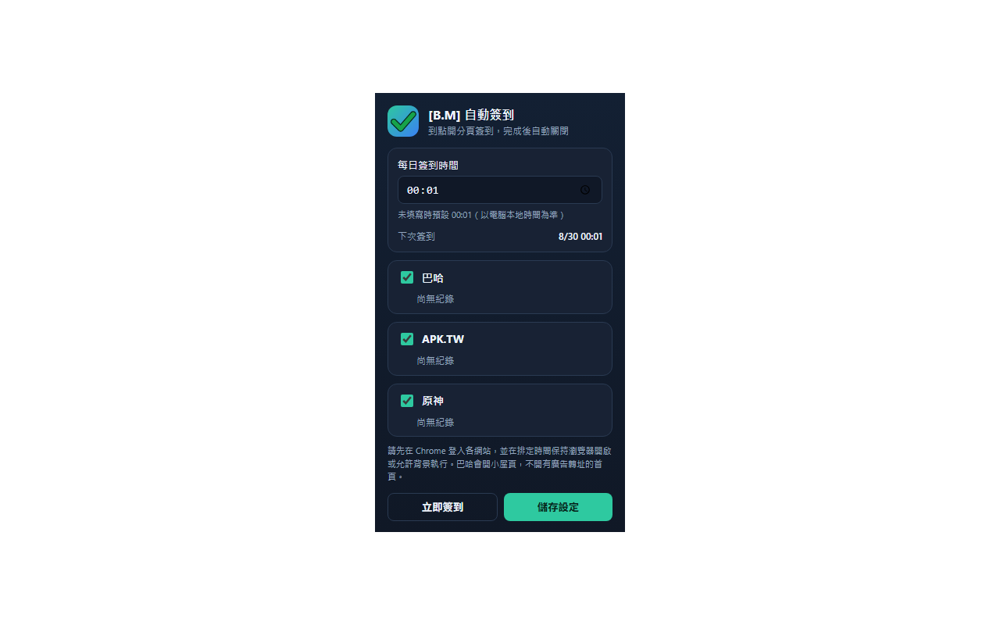

# [B.M] 自動簽到

[](https://developer.chrome.com/docs/extensions/mv3/)
[](https://github.com/BoringMan314/bm-auto-signin)
[](https://github.com/BoringMan314/bm-auto-signin/releases)
[](LICENSE)

瀏覽器擴充功能：依您設定的時間開啟分頁，為**已登入**的支援網站完成每日簽到，成功後自動關閉分頁。

*到点打开分页，为已登录的支持网站完成每日签到，成功后自动关闭。*<br>
*指定時刻にタブを開き、ログイン済みの対応サイトで毎日のサインインを行い、成功後にタブを閉じます。*<br>
*Opens a tab at the scheduled time, signs in on supported sites you are already logged into, then closes the tab.*

> **聲明**：本專案為第三方輔助工具，與巴哈姆特、APK.TW、HoYoLAB／HoYoverse／米哈遊官方無關。使用請遵守各站服務條款；須先在瀏覽器手動登入，本擴充不會代管或儲存密碼。

---



---

## 目錄

- [功能](#功能)
- [系統需求](#系統需求)
- [安裝方式](#安裝方式)
- [本機開發與測試](#本機開發與測試)
- [技術概要](#技術概要)
- [專案結構](#專案結構)
- [版本與多語系](#版本與多語系)
- [隱私說明](#隱私說明)
- [維護者：更新 GitHub 與 Chrome 線上應用程式商店](#維護者更新-github-與-chrome-線上應用程式商店)
- [授權](#授權)
- [問題與建議](#問題與建議)

---

## 功能

點擊工具列圖示開啟彈出視窗：

- **每日簽到時間**：未填寫時預設 **00:01**（以電腦本地時間為準）。排定時間請保持瀏覽器開啟；若當日較晚才開機或開啟 Chrome，也會自動檢查並補簽尚未完成的網站。
- **各站獨立開關**（預設皆啟用）：
  - **巴哈**：開啟 [小屋首頁](https://home.gamer.com.tw/homeindex.php) 簽到。
  - **APK.TW**：開啟 [apk.tw](https://apk.tw/) 簽到。
  - **原神**：開啟 [HoYoLAB 原神簽到活動頁](https://act.hoyolab.com/ys/event/signin-sea-v3/index.html?act_id=e202102251931481)。
- **立即簽到**：不必等到排程，立刻依啟用中的網站依序簽到。
- **成功後關分頁**；若**尚未登入**、**需要驗證碼**、**逾時或失敗**，會**保留分頁**並以通知／頁面提示告知。

若目標網站改版簽到介面或 API，可能需調整對應的內容腳本或 [`background.js`](background.js) 中的選取／呼叫邏輯。

---

## 系統需求

- **Chrome** 或 **Microsoft Edge**（Chromium）等支援 **Manifest V3** 的瀏覽器。
- 各支援網站須先在瀏覽器**手動登入**（Cookie 工作階段有效）。

---

## 安裝方式

### 從 Chrome 線上應用程式商店（建議）

上架審核通過後，請在 [Chrome Web Store](https://chromewebstore.google.com/) 搜尋 **「[B.M] 自動簽到」** 安裝。商店頁面連結將於此處補上。

### 從原始碼載入（開發人員模式）

1. 點選本頁綠色 **Code** → **Download ZIP** 解壓，或執行 `git clone https://github.com/BoringMan314/bm-auto-signin.git` 複製本倉庫。
2. 以 **Chrome** 或 **Microsoft Edge** 開啟 `chrome://extensions`（在 Edge 為 `edge://extensions`）。
3. 開啟「**開發人員模式**」→「**載入未封裝項目**」→ 選取含 [`manifest.json`](manifest.json) 的**專案根目錄**（勿選子資料夾）。
4. 先在 Chrome 登入巴哈、APK.TW、HoYoLAB、苦力怕論壇、LittleSkin（依你要啟用的站），再點工具列圖示設定時間或按「立即簽到」驗證。原神 HoYoLAB、苦力怕論壇與 LittleSkin 預設關閉。

---

## 本機開發與測試

修改 `background.js`、`popup.*`、`content*.js` 或 `overlay.*` 後，在 `chrome://extensions` 將本擴充**重新載入**，再開啟彈出視窗或執行「立即簽到」驗證。

建議逐站測試：已登入成功關分頁、未登入保留分頁、驗證碼保留分頁。排程請將時間設為下一兩分鐘內確認鬧鐘會觸發。

---

## 技術概要

- **背景服務** [`background.js`](background.js)：以 `chrome.alarms` 排程每日簽到；開機／首次開啟 Chrome、視窗出現與定時檢查時補簽漏掉的網站；依序開啟各站分頁；以 `chrome.scripting` 在頁面脈絡呼叫該站簽到介面或官方活動 API；以 `chrome.notifications` 回報結果。
- **彈出視窗** [`popup.html`](popup.html) / [`popup.js`](popup.js) / [`popup.css`](popup.css)：時間、各站開關、下次鬧鐘、上次結果、立即簽到。
- **內容腳本**：[`content.js`](content.js)（APK.TW）、[`content-baha.js`](content-baha.js)、[`content-genshin.js`](content-genshin.js)、[`content-klpbbs.js`](content-klpbbs.js)（苦力怕論壇）、[`content-littleskin.js`](content-littleskin.js)（LittleSkin）在對應網址偵測狀態並回報背景。
- **頁面提示** [`overlay.js`](overlay.js) / [`overlay.css`](overlay.css)：尚未登入時在頁面上顯示提示。
- **設定儲存**：`chrome.storage.local`。

---

## 專案結構

| 路徑 | 說明 |
|------|------|
| [`manifest.json`](manifest.json) | Manifest V3 設定、權限、內容腳本比對網址 |
| [`background.js`](background.js) | 排程、開分頁、簽到協調與通知 |
| [`popup.html`](popup.html) / [`popup.css`](popup.css) / [`popup.js`](popup.js) | 工具列彈出視窗 |
| [`content.js`](content.js) | APK.TW 簽到內容腳本 |
| [`content-baha.js`](content-baha.js) | 巴哈姆特簽到內容腳本 |
| [`content-genshin.js`](content-genshin.js) | 原神 HoYoLAB 簽到內容腳本 |
| [`content-klpbbs.js`](content-klpbbs.js) | 苦力怕論壇簽到內容腳本 |
| [`content-littleskin.js`](content-littleskin.js) | LittleSkin 簽到內容腳本 |
| [`overlay.js`](overlay.js) / [`overlay.css`](overlay.css) | 頁面登入提示 |
| [`_locales/`](_locales/) | 多語系字串（`zh_TW`、`zh_CN`、`ja`、`en_US`） |
| [`privacy-policy.html`](privacy-policy.html) | 隱私權政策（上架商店所需之公開網頁） |
| [`icons/`](icons/) | 工具列與商店用圖示 |
| [`screenshot/`](screenshot/) | 商店與說明用截圖／宣傳圖 |
| [`scripts/make_icons.py`](scripts/make_icons.py) | 產生圖示用腳本（不必打包進商店套件） |

---

## 版本與多語系

- **版本**：以 [`manifest.json`](manifest.json) 的 `version` 為準。
- **預設語系**：`zh_TW`（`default_locale`）。
- **內建語系**：`zh_TW`、`zh_CN`、`ja`、`en_US`（路徑為 `_locales/<code>/messages.json`）。實際顯示依瀏覽器語系與遞減規則。

---

## 隱私說明

本擴充**不蒐集、不上傳**可識別個人之帳戶或密碼；**未內建**遠端可執行程式、分析或廣告追蹤。時間與各站開關僅透過瀏覽器 `storage` 保存在本機。簽到使用您瀏覽器中各站既有的登入工作階段。詳見 [`privacy-policy.html`](privacy-policy.html)。

**上架提醒**：若上架 Chrome Web Store，須在開發人員後台完成隱私實踐聲明，並提供本政策之**公開 HTTPS 網址**（建議以 [GitHub Pages](https://pages.github.com/) 託管專案內的 `privacy-policy.html`）。啟用後網址為：

`https://boringman314.github.io/bm-auto-signin/privacy-policy.html`

於 GitHub 倉庫 **Settings → Pages** 選擇 **Deploy from a branch**，分支 `main`、資料夾 `/ (root)`。

---

## 維護者：更新 GitHub 與 Chrome 線上應用程式商店

### 更新至 GitHub

**Bash / Git Bash / PowerShell：**

```powershell
git add .
git commit -m "docs: 更新內容說明與商店連結"
git push origin main
```

### Chrome 線上應用程式商店：上架欄位草稿

於 [Chrome Web Store 開發人員控制台](https://chrome.google.com/webstore/devconsole) 建立項目時，可直接貼上：

| 欄位 | 建議內容 |
|------|----------|
| 名稱 | `[B.M] 自動簽到` |
| 簡短說明 | `依設定時間開啟分頁，為已登入的巴哈、APK.TW、原神 HoYoLAB、苦力怕論壇、LittleSkin 完成每日簽到，成功後自動關閉。` |
| 類別 | 生產力 |
| 語言 | 中文（台灣） |
| 單一目的 | 依使用者指定時間（或手動立即執行），在已登入的支援網站上完成每日簽到。 |
| 隱私權政策網址 | `https://boringman314.github.io/bm-auto-signin/privacy-policy.html` |

**詳細說明（商店頁）：**

```
[B.M] 自動簽到會在您設定的時間開啟分頁，為「已經在 Chrome 登入」的網站完成每日簽到，成功後自動關閉分頁。

支援：
• 巴哈姆特小屋簽到
• APK.TW
• 原神 HoYoLAB 簽到活動

使用方式：
1. 先在 Chrome 手動登入各網站。
2. 點工具列圖示，設定每日時間（未填則為 00:01，以電腦本地時間為準），並勾選要啟用的網站。
3. 按「儲存設定」。排定時間請保持瀏覽器開啟；若當日較晚才開機或開啟 Chrome，也會自動補簽。
4. 也可按「立即簽到」立刻執行。

若尚未登入、需要驗證碼或簽到失敗，分頁會保留並通知您手動處理。

本擴充為第三方輔助工具，與各網站官方無關。請遵守各站服務條款。本擴充不蒐集、不上傳帳號密碼。
```

**權限說明（隱私實踐／權限理由）：**

| 權限 | 理由 |
|------|------|
| `alarms` | 依使用者設定的本地時間排程每日簽到，開機後補簽漏掉的網站，並處理逾時、重試與徽章清除。 |
| `storage` | 僅在本機保存簽到時間、各站開關與最近結果；不上傳。 |
| `tabs` | 開啟、聚焦或關閉簽到分頁；偵測導向登入頁時保留分頁。 |
| `notifications` | 在本機通知簽到成功、尚未登入、需要驗證碼或失敗。 |
| `scripting` | 在使用者開啟的支援網站分頁內，呼叫該站既有簽到介面或官方活動 API。 |
| 主機權限（apk.tw、gamer.com.tw、hoyolab.com、hoyoverse.com） | 僅用於載入上述簽到頁並完成簽到，不存取其他網站。 |

隱私問卷建議勾選：**不出售資料**、**不使用遠端程式碼**、**不將使用者資料傳送至開發者或第三方伺服器**。本擴充會在本機讀取簽到頁內容以完成點擊／API 呼叫，但不把該內容送出裝置。

**商店素材（本倉庫已備）：**

| 用途 | 檔案 | 尺寸 |
|------|------|------|
| 商店截圖 | [`screenshot/screenshot_1280x800.png`](screenshot/screenshot_1280x800.png) | 1280×800 |
| 小型宣傳圖 | [`screenshot/screenshot_440x280.png`](screenshot/screenshot_440x280.png) | 440×280 |
| 大型宣傳圖 | [`screenshot/screenshot_1400x560.png`](screenshot/screenshot_1400x560.png) | 1400×560 |
| 圖示 | [`icons/icon128.png`](icons/icon128.png) | 128×128（套件內） |

### 更新至 Chrome 線上應用程式商店

請透過 [Chrome Web Store 開發人員控制台](https://chrome.google.com/webstore/devconsole) 手動上傳更新：

1. **遞增版本**：修改 `manifest.json` 中的 `version`（例如從 `0.1.0` 提升至 `0.1.1`）。
2. **封裝套件**：將專案內容壓縮為 ZIP 檔。
   - **必要檔案**：`manifest.json`, `background.js`, `popup.html`, `popup.css`, `popup.js`, `content.js`, `content-baha.js`, `content-genshin.js`, `content-klpbbs.js`, `content-littleskin.js`, `overlay.js`, `overlay.css`, `privacy-policy.html`, `icons/`, `_locales/`
   - **建議不打包**：`.git/`, `.gitignore`, `README.md`, `LICENSE`, `screenshot/`, `scripts/`, `*.psd`, `*.zip`, `*.url`
3. **上傳審核**：在控制台選擇項目 →「套件」→「上傳新套件」。
4. **提交送審**：確認版號、商店文案、截圖、隱私欄位與 `privacy-policy` 公開網址無誤後，點擊「**提交送審**」。

---

## 授權

本專案以 [MIT License](LICENSE) 授權。

---

## 問題與建議

歡迎透過 [GitHub Issues](https://github.com/BoringMan314/bm-auto-signin/issues) 回報錯誤或提出改善建議。回報時請一併提供瀏覽器版本、**介面語言**、**哪一個網站**及重現步驟。
